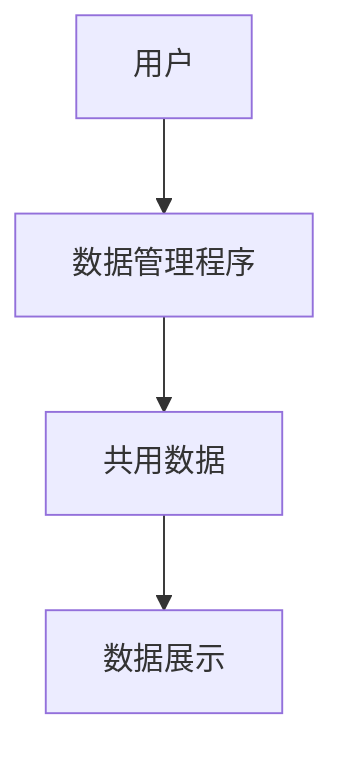

## 运动数据仪表盘项目需求规格说明书

### 一、项目概述

本项目旨在开发一个运动数据展示网站，用于运动数据的可视化。

### 二、功能需求

添加用户信息。用户信息包括用户名、头像（url）、简介。系统中只能有1个用户。

修改用户信息。支持修改用户名、头像、简介。

删除用户信息。可删除系统中的用户。

导入运动数据。提供多个fit文件，程序解析后存入软件中。若数据已经存在，则跳过该数据。

删除运动数据。用户可删除已导入的数据，支持批量删除。

导出运动数据。用户可导出软件中的所有运动数据。

个人信息展示。展示用户的基本信息，包括用户名、简介、头像。

最近运动数据统计。展示最近1周的运动数据统计，包括总距离、总时长、总次数、总热量、平均速度。

日历图展示。以日历图形式展示每年的运动数据，可以切换不同年份。默认展示数据中最新1年的运动数据。日历图默认以距离着色，可切换为时长、次数、热量、平均速度着色。

数据统计和柱形图。分别按周、月、年、全部四种显示模式显示数据。周模式时，数据统计部分按周统计总距离、总时长、总次数、总热量、平均速度，柱形图部分的横轴为天，纵轴为默认为运动距离，可以切换为时长、次数、热量、平均速度。月、年、全部显示模式时，数据统计部分按月、年、全部统计总距离、总时长、总次数、总热量、平均速度，柱形图部分的横轴为天、周、月、年，纵轴默认为运动距离，可以切换为时长、次数、热量、平均速度。

运动列表。以列表形式展示所有运动数据，包括运动日期、运动类型、运动距离、运动时长、热量、平均速度、最大速度、平均心率、最大心率、平均踏频、最大踏频。默认以运动日期倒叙排列，用户可点击表头切换排序方式。

### 三、非功能需求

数据管理程序为单独的模块，可以独立运行。支持单机、github actions中运行。

数据可存储到sqlite数据库中，或者使用JSON文件。

数据展示使用Vue3框架开发。

### 四、系统设计

#### 系统上下文模型

无

#### 系统用况图

无

#### 体系结构设计



#### 数据模型设计

用户对象。

```json
{
    "user": {
        "id": 1,
        "username": "user123",
        "avatar_url": "https://...",
        "bio": "运动爱好者"
    }
}
```

活动对象。

```json
{
    "activities": [
        {
            "id": 1,
            "activity_type": "riding",
            "start_time": "2024-01-15T08:00:00",
            "duration": 3600,
            "distance": 10500,
            "calories": 500,
            "max_speed": 4.5,
            "avg_speed": 2.9,
            "max_heart_rate": 180,
            "avg_heart_rate": 150,
            "max_cadence": 95,
            "avg_cadence": 85,
            "max_power": 350,
            "avg_power": 200,
            "normalized_power": 220,
            "elevation_gain": 120
        }
    ]
}
```

注意：心率、踏频、功率等字段为可选字段，根据FIT文件中是否包含相应数据而定。如果FIT文件中没有这些数据，对应字段将为null或不存在。

#### 对象类设计

无

#### 页面设计

仪表盘页。上下两栏结构，顶部为导航区，底部为内容区。

- 导航区左侧为个人信息展示，包括头像、用户名、简介。右侧为导航菜单区，有仪表盘、运动记录两个菜单。

- 内容区展示最近1周运动统计、日历图、数据统计和柱形图三部分。分上下两部分。上半部分左侧1/4为最近1周运动统计，右侧为日历图。下半部分为数据统计和柱形图。

运动记录页。上下两栏结构，顶部为导航区，底部为内容区。

- 导航区的内容与仪表盘页面相同。

- 内容区为表格，展示所有运动数据。

页面设计的线框图设计见Figma文件。
